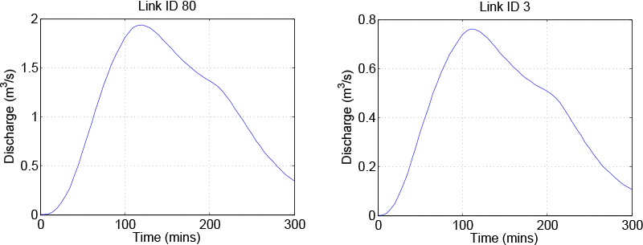
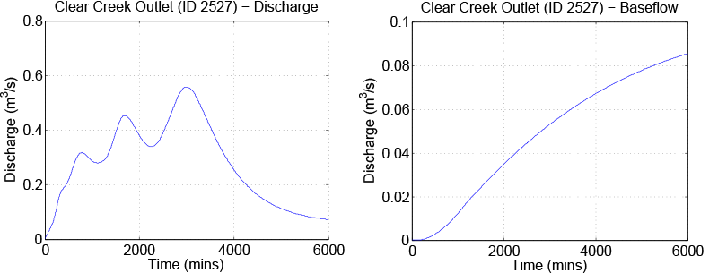

Getting started
===============

In this section, we will give the steps and data needed for running basic simulations. This section is intended for getting a new user up and running quickly, and to provide links in this documentation for more information when needed.

If you are not using the `UoI HPC infrastructures <https://hpc.uiowa.edu/>`_, be sure to follow the steps in Section :ref:`Installation` for installing the ASYNCH solvers.

.. tip:: For Argon users.
    For those using Iowa HPC resources, downloading and compiling the source code is not necessary. But to be able to use the prebuilt executables, setting up your environment is necessary. The prefered way is to edit your ``~/.bash_profile``:

    .. code-block:: sh

        # User specific environment and startup programs for Argon

        export PATH=$PATH:$HOME/.local/bin:/Dedicated/IFC/.argon/bin

        export LD_LIBRARY_PATH=$LD_LIBRARY_PATH:/Dedicated/IFC/.argon/lib

        # Load module OpenMPI and HDF5
        module load zlib/1.2.11_parallel_studio-2017.1
        module load hdf5/1.8.18_parallel_studio-2017.1
        module load openmpi/2.0.1_parallel_studio-2017.1

.. tip:: For Neon users.
    For those using Iowa HPC resources, downloading and compiling the source code is not necessary. But to be able to use the prebuilt executables, setting up your environment is necessary. The prefered way is to edit your ``~/.bash_profile``:

    .. code-block:: sh

        # User specific environment and startup programs for Neon

        export PATH=$PATH:$HOME/.local/bin:/Dedicated/IFC/.local/bin:/Dedicated/IFC/.neon/bin

        # Load module OpenMPI and HDF5
        module load openmpi/intel-composer_xe_2015.3.187-1.8.8
        module load hdf5/1.8.17

The ASYNCH directory contains a folder called ``examples``, which contains several data files for starting sample simulations, as well as sample outputs for comparision. The ``examples`` directory should be copied to a location where the user has write access (for example, the home directory). On Neon or Argon, this can be done with

.. code-block:: sh

  cp -r /Dedicated/IFC/asynch/examples/ ~/

For the first example, we will produce output for a small basin with 11 links using a hydrological model with constant runoff. The global file to setup this simulation is ``test.gbl``. This uses the model given in Section :ref:`Constant Runoff Hydrological Model`. If using your own machine, the simulation can be run with the command

.. code-block:: sh

  mpirun -np 1 <bin path>/asynch test.gbl

As calculations are performed, you will see output produced to the terminal window. If using Neon or Argon (or any system using the Sun Grid Engine), the submit script test.sh can be used to run the simulation. Use the command

.. code-block:: sh

  qsub test.sh

while in the examples directory to launch the job. Output from the program will be produced in a log file with a name like test run.o###### Try using the command

.. code-block:: sh

  qstat -u <username>

to monitor the progress of your job.

.. warning:: A submit script is needed to run a job on multiple machines of Iowa HPC resources.
    If you attempt to run an ASYNCH simulation using just ``mpirun`` at a terminal window, you are probably running ASYNCH on a login node. Doing this limits the number of cores available to 12, slows down all other users's connections, and is an easy way to be reported to the HPC admins for misuse of resources!

When the program is complete, the output results are written to the folder ``examples`` The global file causes the production of three output fìles: ``test.dat``, ``test.pea``, and ``test.rec``. These files should be identical to those found in ``examples/results``. The ``.dat`` file contains the output hydrograph for links with link ids 3 and 80. The pea file contains the peakfow information for every link. The rec file contains the fnal value of every state of every link at the end of the simulation. For this simulation, all output files are small enough to view in a text editor.

The simulations performed will use only 1 MPI process. To increase this number, use, for example,

.. code-block:: sh

  mpirun -np 2 <ASYNCH directory>/asynch test.gbl

or modify ``test.sh`` to use more processes. This can be done by modifying the environment

.. code-block:: sh

  #$ -smp 1

to use 2 processes instead of 1. Also be sure to modify the last line with mpirun so MPI looks for 2 processes. When using more than 1 process, your results may difer slightly from those in ``examples/results``. In fact, the results may vary slightly from simulation to simulation, even if nothing changed in the global file. This is a result from the asynchronous communication used by ASYNCH for MPI processes and is an expected behavior.

.. _figure-2:

  Output from the sample simulation.

As a second example, try the same procedure as before using the global file ``clearcreek.gbl``. If using an Iowa HPC resource, the submit script ``clearcreek.sh`` can be used. The model for this simulation is the toplayer hydrological model using the Clear Creek river basin See Section :ref:`Top Layer Hydrological Model`. Results for the output discharge and basefow are given in :ref:`figure-3`. This basin is larger than in the previous simulation as it contains about 6,000 links. This is a good example to experiment with the number of processes used.

.. _figure-3:

  Output from the toplayer model sample simulation.
