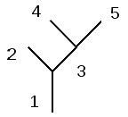

Terminology and Definitions
===========================

In this section, we define terminology and conventions used throughout this documentation.

Ordinary differential equation
------------------------------

By ordinary differential equation (ODE), we mean a system of differential equations with all unknowns dependent upon time. These independent variables are referred to as *states*. The ASYNCH solvers can only be used for ODEs with the time derivatives of the states isolated. See Section [sec: example models] for examples. Partial differential equations (PDEs) have states that depend upon multiple independent variables, and cannot be outright solved with the ASYNCH solvers.

Algebraic equations
-------------------

Algebraic equations are equations which do not possess derivatives or integrals of states with respect to independent variables. If a system of equations consists of a mixed collection of ODEs and algebraic equations, then the system is referred to as a system of *differential-algebraic equations (DAEs)*. See Section [sec: linear reservoir hydrological model] for an example.

Systems of ODEs
---------------

The ASYNCH solvers are intended for solving systems of ODEs (and limited DAEs) with a tree structure. By tree structure, we mean that the system of equations can be clustered together in a way so that dependence upon clusters is one way. As an example, consider the system of differential equations

.. math::

  \frac{dy_1}{dt} &= -y_1 + y_2 + y_3 + y_4 + y_5 + y_6 \\
  \frac{dy_2}{dt} &= -y_2 + y_3 + y_4 + y_5 + y_6 \\
  \frac{dy_3}{dt} &= -y_3 + y_4 \\
  \frac{dy_4}{dt} &= -y_4 \\
  \frac{dy_5}{dt} &= -y_5 + y_6 + y_7 + y_8 + y_9 + y_{10} \\
  \frac{dy_6}{dt} &= -y_6 + y_7 + y_8 + y_9 + y_{10} \\
  \frac{dy_7}{dt} &= -y_7 + y_8 \\
  \frac{dy_8}{dt} &= -y_8 \\
  \frac{dy_9}{dt} &= -y_9 + y_{10} \\
  \frac{dy_{10}}{dt} &= -y_{10}

This system can be clustered into the pairs:

.. math::

  1: \left[y_1, y_2\right] \hspace{.1in} 2:\left[y_3, y_4\right] \hspace{.1in} 3:\left[y_5, y_6\right] \hspace{.1in} 4:\left[y_7, y_8\right] \hspace{.1in} 5:\left[y_9, y_{10}\right]

The dependency of these clusters is one way in the sense that the equations for the variables in cluster 3 depend only upon the variables in clusters 4 and 5, the equations for the variables in cluster 1 depend only upon clusters 2 and 3, and the equations for the variables in clusters 2, 4, and 5 do not depend upon any other cluster. Graphically, this system of equations could be viewed to have the tree structure given in:

.. _explicit-example:

Links
-----

In the ASYNCH source code and in this document, the clusters of variables are referred to as *links*. Every link has a positive integer attached to it that identifies the link uniquely. This number is referred to as the *link ID*. The unknowns in the clusters are referred to as the *states of the link*.

Peakflow
--------

The term *peakflow* is used frequently with ASYNCH. This is a hydrological term, but it can take meaning in other applications. A peakflow of a state is the maximum value of that state over a period of time.

Model
-----

The term *model* is used frequently in technical disciplines to refer to a (usually mathematical) procedure or computer program for obtaining a description for how a natural process works. In this documentation, a model refers to the collection of equations, *but not their solution*. The entire purpose of ASYNCH is to solve ODEs efficiently, thus producing their solution. No model created for ASYNCH should ever contain time steps. The equations (:ref:`_explicit-example`) are an example of a model.

State vector
------------

Each model has a number of states that are to be determined at each link. At a specific time, these states are stored in a vector, known as a *state vector*. Similarly, the value of the differential and algebraic equations at a particular time and state are stored in an *equation-value vector*. There is a correspondence between state and equation-value vectors at each link. For example, if the underlying model is a system of differential equations, then the derivative of the first state in a state vector is stored in the first entry of the equation-value vectors, the derivative of the second state in a state vector is stored in the second entry of the equation-value vectors, etc.

As an example, a state vector for equations ([eq: explicit example]) will look like

.. math::

  [y_1,\ y_2,\ y_3,\ y_4,\ y_5,\ y_6,\ y_7,\ y_8,\ y_9,\ y_{10}]^T

while an equation-value vector will look like

.. math::

  \left[ \frac{dy_1}{dt},\ \frac{dy_2}{dt},\ \frac{dy_3}{dt},\ \frac{dy_4}{dt},\ \frac{dy_5}{dt},\ \frac{dy_6}{dt},\ \frac{dy_7}{dt},\ \frac{dy_8}{dt},\ \frac{dy_9}{dt},\ \frac{dy_{10}}{dt} \right]^T

Discontinuities
---------------

Some models contain discontinuities in their equations. This can include not only the equation themselves, but also in their derivatives. ASYNCH supports intelligent handling of these abrupt changes when the equations can be described piecewise. For example, the differential equation

.. math::

  \frac{dy}{dt} &= \left\{ \begin{array}{c} -(y-5) + f(t), \mbox{for } y < 5 \\
                                            -(y-5)^2 + f(t), \mbox{for } y \geq 5
                           \end{array} \right.

with some forcing function :math:`f`, has a discontinuity in the derivative of :math:`y`. Each component of the piecewise function is referred to as a *discontinuity state*.

Computing
---------

A few computer related terms are thrown around frequently in this document (and in parallel computing in general) that are worth describing.

-  A *node* is a physical computer. This includes any related hardware inside the computer (cores, memory, hard disks, etc). The term *cluster* is used to refer to an interconnected group of nodes.

-  A *core*, *processor*, or *slot* (in the case of Iowa HPC resources) are the physical processing units in computers. These are the components that actually perform computations.

-  A *process* is an instance of a running program. ASYNCH uses MPI processes to achieve parallelism. This means several instances of ASYNCH are run simultaneously, each able to communicate with each other. Because this document refers to ASYNCH, the phrase *MPI process* is interchangeable with process. It is simply used to emphasize that communication occurs with MPI.

-  A *thread* is a sequence of instructions (code) to a processor. *Multithreading* is when many threads are created by a program and potentially executed simultaneously on a single node. ASYNCH does not currently support multithreading explicitly (it may occur “behind the scenes” in MPI, however).

Generally with ASYNCH, a one-to-one correspondence between the number of cores and processes is desired. More processes than cores means some cores must run more than one process, creating computational bottlenecks. More cores than processes means some cores will have no work to complete.
